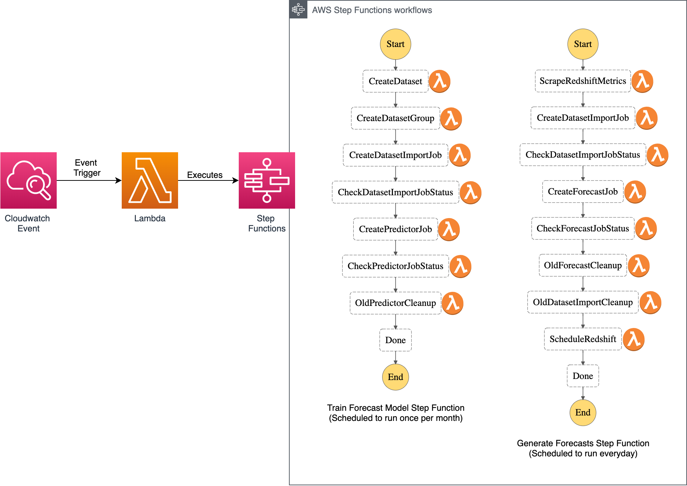

# Redshift Smart Pause and Resume

 [](http://www.serverless.com)

Open source tool to automatically pause and resume Redshift (single and multi-node) clusters using AWS Lambda, CloudWatch Metrics and Events, Amazon Forecast and Step Functions.

## About

### Resuming and Pausing Redshift using Cluster CPU utilisation Metrics from CloudWatch

CPU utilisation data from an existing Redshift data warehouse is scraped from Cloudwatch metrics. In particular, the metric is the average CPU utilisation at 15 minute intervals by default (value is configurable: recommended values are 5, 15, 30, 60 minute intervals). The data scraped is then used to train an Amazon Forecast model, and the resulting forecast predictions are used to determine when to resume and pause a Redshift data warehouse. 

A threshold value is set and used determine when to resume and pause a Redshift cluster. To illustrate, if a threshold value of 5% (i.e., 5% CPU utilisation) is set, the Reshift cluster will be scheduled to be resumed around a timestamp when CPU utilisation is forecasted to be over the threshold value. On the other hand, given the same threshold value, a Reshift cluster will be scheduled to be paused around a timestamp when CPU utilisation is forecasted to be under the threshold value. 

Forecasted CPU utilisation activity example is showcased below. For this example, given the forecasted values:

* The Redshift cluster will be scheduled to resume on 7:45 
* The Redshift cluster will be scheduled to pause on 21:15 
* A buffer of 30 minutes is subtracted and added from the actual timestamps to give ample time for the Redshift cluster to resume and pause, respectively.


### AWS Serverless Architecture 

This tool in a nutshell consists to 2 step functions: (1) [Train Forecast Model Step Function](#train-forecast-model-step-function) and (2) [Generate Forecasts Step Function](#generate-forecasts-step-function). Both of these step functions are executed using Lambda functions, and these Lambda functions are triggered with Scheduled Cloudwatch Events. Events are scheduled based on the timezone specified when deploying the tool. 



### Train Forecast Model Step Function

The following step function consists of a number of steps aimed to produce an Amazon Forecast Model predicting Redshift CPU utilisation. This step function can be scheduled to run more frequently depending on how often Redshift utilisation activity pattern changes. If AutoML is enabled the most appropriate forecast model will be fitted to the provided dataset. By default this step function is scheduled to run on the first day of each month at 9:00 (Time based on the provided timezone). 

### Generate Forecasts Step Function

The following step function consists of a number of steps aimed to produce Amazon Forecast Predictions using the resulting model trained from the above mentioned step function. This step function is scheduled daily. In particular, Redshift metrics data scraped the previous day is used alongside existing data to generate redshift metric forecasts for the following day. Forecasts are then used to determine when to resume and pause the Redshift cluster. By default this step function is scheduled to run everyday at 12:05 midnight (Time is based on the provided timezone). 

## Setup
 
### Deploy 

1. Install Serverless Framework
```bash
npm install serverless
```

2. Install AWS CLI 
```bash
pip3 install awscli 
```

Configure AWS CLI following instructions found [here](#https://docs.aws.amazon.com/cli/latest/userguide/cli-chap-configure.html#cli-quick-configuration). Ensure that the user configured has the appropriate IAM permissions to create Lambda Functions, S3 Buckets, IAM Roles, Step functions, Amazon Forecast resources and CloudFormation Stacks.

3. Install Redshift Smart Pause and Resume
```bash
serverless create --template-url https://github.com/servian/aws-redshift-smart-pause-and-resume --path aws-redshift-smart-pause-and-resume
```

4. Change to Redshift Smart Pause and Resume directory
```bash
cd aws-redshift-smart-pause-and-resume 
```

5. Install Serverless Plugins
```bash
serverless plugin install --name serverless-python-requirements
serverless plugin install --name serverless-iam-roles-per-function
serverless plugin install --name serverless-pseudo-parameters
serverless plugin install --name serverless-local-schedule
```

6. Deploy Service to AWS Account. The options `redshiftclusterid` and `datasetname` are required and need to be specified upon deploying the tool. (See [Deployment Options](#deployment-options) below for more details on these and other options provided).

* **`NOTE:`** If deploying the tool to a second Redshift cluster ensure that the value for `service:` in the `serverless.yml` template is changed. Currently, the value is `smart-sched`. Possible value is `smart-sched-01`.

```bash
serverless deploy \
 [--region <AWS region>] \
 [--aws-profile <AWS CLI profile>] \
 [--redshiftclusterid <AWS redshift cluster id>] \
 [--datasetname <AWS forecast dataset name>]
```

7. After Deployment run the following script to initially scrape for data and train forecast model. (See [Scraping and Training Forecast Model After Deployment](#Scraping-and-Training-Forecast-Model-After-Deployment) below for more details and details on some options provided).

* **`NOTE:`** If the value for `service:` in the `serverless.yml` template was changed, be sure to provide a value for `cfnstackname` which consistent to the change made. Since the stack name is dependent on the value provided for `service:`.

```
python3 local_scrape_and_train.py 
[--awsprofile <value>] \
[--numdaystoscrape <value>] \
[--cfnstackname  <value>] \
[--stage  <value>]
```

### Update

1. Remove existing library

2. Install/recreate Redshift Smart Pause and Resume
```bash
serverless create --template-url https://github.com/servian/aws-redshift-smart-pause-and-resume --path aws-redshift-smart-pause-and-resume
```

3. Change to Redshift Smart Pause and Resume directory
```bash
cd aws-redshift-smart-pause-and-resume 
```

3. Redeploy service to AWS Account. The options `redshiftclusterid` and `datasetname` are required and need to be specified upon deploying the tool. (See [Deployment Options](#deployment-options) below for more details on these and other options provided). 

* **`NOTE:`** if updating the tool to a second Redshift cluster ensure that the value for `service:` in the `serverless.yml` template is changed and is consistent to when this tool was first deployed. Currently, the value is `smart-sched`. Possible value is `smart-sched-01`, if this is the value used when deploying the tool to a second Redshift cluster. 
```bash
serverless deploy \
 [--region <AWS region>] \
 [--aws-profile <AWS CLI profile>] \
 [--redshiftclusterid <AWS redshift cluster id>] \
 [--datasetname <AWS forecast dataset name>]
```

### Remove

1. Change to Redshift Smart Pause and Resume directory
```bash
cd aws-redshift-smart-pause-and-resume 
```

2. Remove Service from AWS Account
```bash
serverless remove \
 [--region <AWS region>] \
 [--aws-profile <AWS CLI profile>] \
 [--redshiftclusterid <AWS redshift cluster id>] \
 [--datasetname <AWS forecast dataset name>]
```

## Deployment Options

```
serverless deploy \
[--aws-profile <value>] \
[--region <value>] \
[--stage <value>] \
[--redshiftclusterid <value>] \
[--datasetname <value>] \
[--enableautoml <value>] \
[--algorithmarn <value>] \
[--timezone <value>] \
```

`--aws-profile` (string)

AWS Profile to deploy resources (default value: `default`)

`--region` (string)

AWS Region to deploy resources (default value: `ap-southeast-2`: Sydney Region)

`--stage` (string)

environment suffix (default value: `dev`)

`--redshiftclusterid` (string: REQUIRED)

unique identifier of the redshift cluster to enable smart scheduling

`--datasetname` (string: REQUIRED)

a name for the Amazon forecast dataset. It is recommeded to have the name to be the similar to the Redshift cluster ID, but instead of hyphens use underscores instead. e.g., if `redshiftclusterid` is `"test-warehouse"` then `datasetname` is `"test_warehouse"`

`--enableautoml` (string)

possible values `ENABLED` or `DISABLED` (default: `DISABLED`)

`--algorithmarn` (string)

[Possible values](https://docs.aws.amazon.com/forecast/latest/dg/aws-forecast-choosing-recipes.html) (default: `arn:aws:forecast:::algorithm/Deep_AR_Plus`)

`--timezone` (string)

[Possible values](https://en.wikipedia.org/wiki/List_of_tz_database_time_zones)  (default: `Australia/Melbourne`)

`--intervalminutes` (int)

granularity of average Redshift CPU utilisation to use throughout stack (default: `15`)

## Scraping and Training Forecast Model After Deployment

The following script scrapes Redshift CPU utilisation data and uses it to initially train an Amazon Forecast Model after deploying the stack. 

```
python3 local_scrape_and_train.py 
[--awsprofile <value>] \
[--numdaystoscrape <value>] \
[--cfnstackname  <value>] \
[--stage  <value>]
```

`--awsprofile` (string)

AWS Profile to deploy resources (default value: `default`)

`--numdaystoscrape` (string)

Number of days (from previuos day) worth of Redshift CPU utilisation data to scrape (default value: `14`)

`--cfnstackname` (string)

Cloudformation stack name (default value: `smart-sched`. Which is `service-name` in serverless.yml template)

`--stage` (string)

environment suffix (default value: `dev`) 

## References

[Automating your Amazon Forecast Workflow with Lambda, Step Functions and Cloudwatch Events Rule](https://aws.amazon.com/blogs/machine-learning/automating-your-amazon-forecast-workflow-with-lambda-step-functions-and-cloudwatch-events-rule/)
