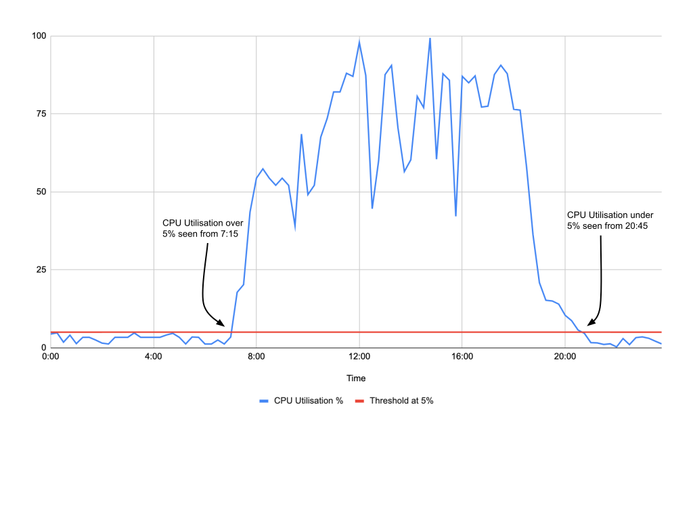

# Redshift Smart Pause and Resume (!!WIP)

 [](http://www.serverless.com)

Open source application to automatically resume and pause Redshift using AWS Lambda, CloudWatch Metrics and Events, Amazon Forecast and Step Functions.

## About

### Resuming and Pausing Redshift using Cluster CPU Utilisation Metrics from CloudWatch

CPU Utilisation data from an existing Redshift data warehouse is scraped from Cloudwatch metrics. In particular, the metric is the average CPU utilisation at 15 minute intervals by default (value is configurable: recommended values are 5, 15, 30, 60 minute intervals). The data scraped is then used to train an Amazon Forecast model, and the resulting forecast predictions are used to determine when to resume and pause a Redshift data warehouse. 

A threshold value is set and used determine when to resume and pause a Redshift cluster. To illustrate, if a threshold value of 5% (i.e., 5% CPU Utilisation) is set, the Reshift cluster will be scheduled to be resumed around a timestamp when CPU Utilisation is forecasted to be over the threshold value. On the other hand, given the same threshold value, a Reshift cluster will be scheduled to be paused around a timestamp when CPU Utilisation is forecasted to be under the threshold value. 

Forecasted CPU utilisation activity example is showcased below. For this example, given the forecasted values:

* The Redshift cluster will be scheduled to resume on 7:45 
* The Redshift cluster will be scheduled to pause on 21:15 
* A buffer of 30 minutes is subtracted and added from the actual timestamps to give ample time for the Redshift cluster to resume and pause, respectively.



### Forecast Model Training Step Function

The following step function consists of a number of steps aimed to produce an Amazon Forecast Predictor Model predicting Redshift CPU Utilisation. This step function can be scheduled to run more frequently depending on how often Redshift Utilisation activity pattern changes. If AutoML is enabled the most appropriate forecast model will be fitted to the provided dataset. By default this step function is scheduled to run on the first day of each month at 9:00 (Time based on the provided timezone). 


### Forecast Model Prediction Step Function

The following step function consists of a number of steps aimed to produce Amazon Forecast Predictions using the resulting model trained from the above mentioned step function. This step function can be scheduled daily. In particular, Redshift metrics data scraped the previous day is used alongside existing data to generate redshift metric forecasts for the following day. Forecasts are then used to determine when to resume and pause the Redshift cluster. By default this step function is scheduled to run everyday at 12:05 midnight (Time is based on the provided timezone). 


## Setup
 
### Deploy 

1. Install Servereless Framework
```bash
npm install serverless
```

2. Install AWS CLI 
```bash
pip3 install awscli 
```

Configure AWS CLI following instructions found [here](#https://docs.aws.amazon.com/cli/latest/userguide/cli-chap-configure.html#cli-quick-configuration). Ensure that the user configured has the appropriate IAM permissions to create Lambda Functions, S3 Buckets, IAM Roles, Step functions, Amazon Forecast resources and CloudFormation Stacks.

3. Install Redshift Smart Pause and Resume
```bash
serverless create --template-url https://github.com/servian/aws-redshift-smart-pause-and-resume --path aws-redshift-smart-pause-and-resume
```

4. Change to Redshift Smart Pause and Resume directory
```bash
cd aws-redshift-smart-pause-and-resume 
```

5. Install Serverless Plugins
```bash
serverless plugin install --name serverless-python-requirements
serverless plugin install --name serverless-iam-roles-per-function
serverless plugin install --name serverless-pseudo-parameters
serverless plugin install --name serverless-local-schedule
```

6. Deploy Service to AWS Account. (See [Deployment Options](#deployment-options) below for list of options)
```bash
serverless deploy [--region <AWS region>] [--aws-profile <AWS CLI profile>] [--redshiftclusterid <AWS redshift cluster id>]
```

### Update

1. Remove existing library

2. Install/recreate Redshift Smart Pause and Resume
```bash
serverless create --template-url https://github.com/servian/aws-redshift-smart-pause-and-resume --path aws-redshift-smart-pause-and-resume
```

3. Change to Redshift Smart Pause and Resume directory
```bash
cd aws-redshift-smart-pause-and-resume 
```

3. Redeploy Service to AWS Account
```bash
serverless deploy [--region <AWS region>] [--aws-profile <AWS CLI profile>] [--redshiftclusterid <AWS redshift cluster id>]
```

### Remove

1. Change to Redshift Smart Pause and Resume directory
```bash
cd aws-redshift-smart-pause-and-resume 
```

2. Remove Service from AWS Account
```bash
serverless remove [--region <AWS region>] [--aws-profile <AWS CLI profile>]
```

## Deployment Options

```
serverless deploy \
[--aws-profile <value>] \
[--region <value>] \
[--stage <value>] \
[--redshiftclusterid <value>] \
[--enableautoml <value>] \
[--algorithmarn <value>] \
[--timezone <value>] \

```

`--aws-profile` (string)

AWS Profile to deploy resources (default value: `default`)

`--region` (string)

AWS Region to deploy resources (default value: `ap-southeast-2`: Sydney Region)

`--stage` (string)

environment suffix (default value: `dev`)

`--redshiftclusterid` (string: REQUIRED)

unique identifier of the redshift cluster to enable smart scheduling

`--enableautoml` (string)

possible values `ENABLE` or `DISABLED` (default: `DISABLED`)

`--algorithmarn` (string)

[Possible values](https://docs.aws.amazon.com/forecast/latest/dg/aws-forecast-choosing-recipes.html) (default: `arn:aws:forecast:::algorithm/ARIMA`)

`--timezone` (string)

[Possible values](https://en.wikipedia.org/wiki/List_of_tz_database_time_zones)  (default: `Australia/Melbourne`)

`--intervalminutes` (int)

granularity of average Redshift CPU Utilisation to use throughout stack (default: `15`)

## Adding data to train Amazon Forecast Model for the first time after deployment

The following script scrapes Redshift CPU Utilisation data and uses it to initially train an Amazon Forecast Model after deploying the stack. 

```
python3 local_scrape_and_train.py 
[--awsprofile <value>] \
[--numdaystoscrape <value>] \
[--cfnstackname  <value>] \
[--stage  <value>] \
```

`--awsprofile` (string)

AWS Profile to deploy resources (default value: `default`)

`--numdaystoscrape` (string)

Number of days (from previuos day) worth of Redshift CPU Utilisation data to scrape (default value: `7`)

`--cfnstackname` (string)

Cloudformation stack name (default value: `smart-sched`. Which is `service-name` in serverless.yml template)

`--stage` (string)

environment suffix (default value: `dev`) 

## References

[Automating your Amazon Forecast Workflow with Lambda, Step Functions and Cloudwatch Events Rule](https://aws.amazon.com/blogs/machine-learning/automating-your-amazon-forecast-workflow-with-lambda-step-functions-and-cloudwatch-events-rule/)
